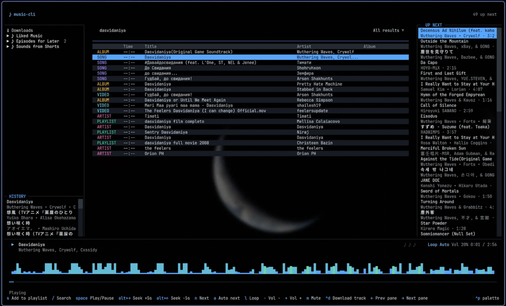

<h2 align="center">music-cli</h2>

<p align="center">An ad-free YouTube Music player for the terminal.</p>



music-cli got both TUI and CLI; both of them are in sync, allowing agent controls (you can run CLI without the TUI and keeping it run in the background).

## Installation

Requires **Python 3.14**.

```sh
cd &&
git clone https://github.com/Igidn/music-cli.git &&
cd music-cli/ && 
uv tool install --python 3.14 .
```

On **Linux**, you also need GStreamer MP4/AAC plugins:

```sh
# Debian / Ubuntu
sudo apt install gst-plugins-good1.0 gst-libav1.0

# Fedora / RHEL
sudo dnf install gstreamer1-plugins-good gstreamer1-libav

# Arch
sudo pacman -S gst-plugins-good gst-libav
```

Login to YouTube Music:

```sh
music-cli login
```

## Commands

| Command | Description |
| --- | --- |
| `play <query>` | Play a search result |
| `play --video-id <id>` | Play a specific video |
| `play --playlist <id>` | Play a playlist |
| `download <id>` | Download a track for offline listening |
| `pause` / `resume` / `toggle` | Transport control |
| `next` / `stop` | Skip ahead / halt playback |
| `seek +30` / `seek 120` | Skip forward or jump to a position |
| `volume 50` / `volume +10` | Set or adjust the volume |
| `mute on` / `loop on` / `auto-next on` | Toggle settings |
| `status` / `queue` | Current track and up-next list |
| `search "..."` | Search YouTube Music |
| `playlists list` / `playlists play <id>` | List and play playlists |
| `playlists downloaded` | List offline downloads |
| `history` | Recently played tracks |

## Keybindings

| Key | Action |
| --- | --- |
| `/` | Search |
| `Space` | Play / Pause |
| `Alt+←` / `Alt+→` | Seek ±5s |
| `n` | Next track |
| `a` / `l` / `m` | Auto-next / Loop / Mute |
| `+` / `-` | Volume |
| `Ctrl+d` | Download current track |

## License

MIT. See [LICENSE](LICENSE).
